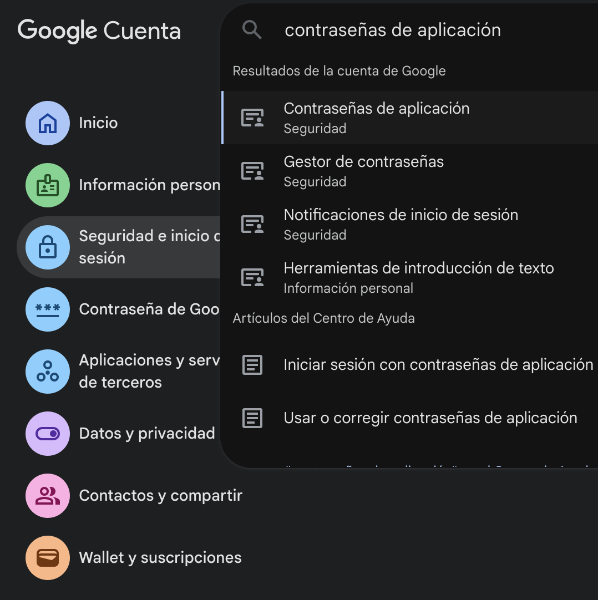
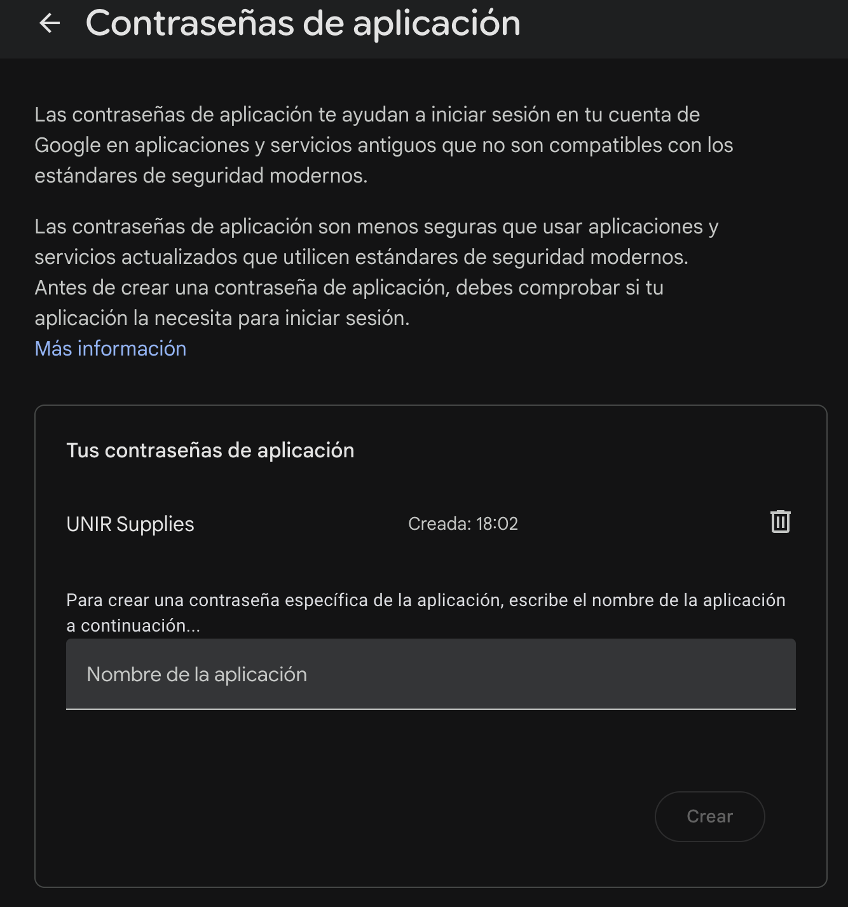
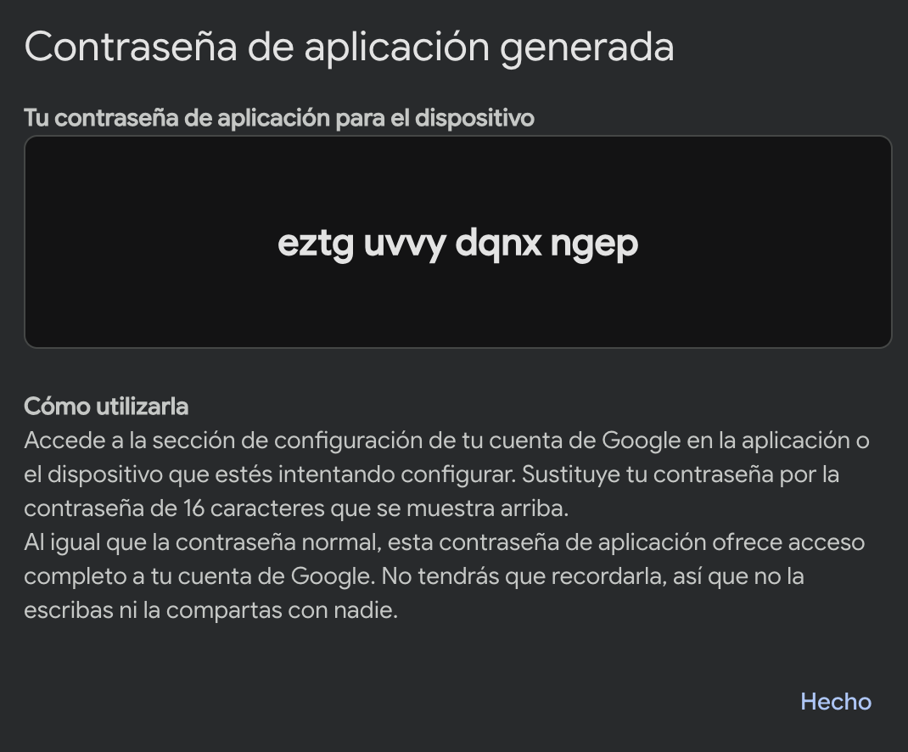

# back-end-supplies-communications

Microservicio de **comunicaciones asíncronas** para el ecosistema **UNIR Supplies**. Combina dos canales de comunicación independientes:

1. **Eventos RabbitMQ** → Consume eventos `ORDER_CREATED` publicados por [back-end-supplies-orders-and-events](../back-end-supplies-orders-and-events) y envía notificaciones por **correo electrónico**.
2. **WebSocket (STOMP)** → Proporciona un chat de soporte técnico en tiempo real con respuestas automáticas simuladas.

---

## Tabla de contenidos

- [Arquitectura general](#arquitectura-general)
- [Eventos RabbitMQ — Notificaciones por email](#eventos-rabbitmq--notificaciones-por-email)
- [WebSocket — Chat de soporte](#websocket--chat-de-soporte)
- [Configuración de Gmail (App Password)](#configuración-de-gmail-app-password)
- [Configuración](#configuración)

---

## Arquitectura general

```
┌─────────────────────────────────────────────────────────────────┐
│                  supplies-communications (port 8082)            │
│                                                                 │
│  ┌──────────────────────────┐   ┌────────────────────────────┐  │
│  │   RabbitMQ Consumer      │   │   WebSocket (STOMP)        │  │
│  │                          │   │                            │  │
│  │  OrderEventListener      │   │  SupportChatController     │  │
│  │       ↓                  │   │       ↓                    │  │
│  │  EmailService            │   │  SupportResponseService    │  │
│  │       ↓                  │   │       ↓                    │  │
│  │  JavaMailSender (SMTP)   │   │  /topic/support/{clientId} │  │
│  └──────────────────────────┘   └────────────────────────────┘  │
└─────────────────────────────────────────────────────────────────┘
         ▲                                    ▲
         │                                    │
   RabbitMQ Exchange                   Cliente WebSocket
   "pedidos.creados"                   (navegador / app)
```

Se registra en **Eureka** como `supplies-communications`. Escucha en el **puerto 8082**.

---

## Eventos RabbitMQ — Notificaciones por email

### Flujo completo

```
orders-and-events ──► RabbitMQ ──► OrderEventListener ──► EmailService ──► Gmail SMTP ──► 📧
                      Exchange      (consumer)             (sender)
                   "pedidos.creados"
                    routing key:
                   "order.created"
                         │
                    Cola duradera:
               "mails.order.created"
```

### `RabbitConfig`

Configura la infraestructura del consumidor:

- **`TopicExchange`**: `pedidos.creados` (el mismo declarado por el productor).
- **`Queue`**: `mails.order.created` — cola duradera exclusiva de este servicio.
- **`Binding`**: Vincula la cola al exchange con routing key `order.created`.
- **`JacksonJsonMessageConverter`**: Deserializa automáticamente los mensajes JSON a objetos Java.
- **`SimpleRabbitListenerContainerFactory`**: Factoría del listener con el converter JSON.

### `OrderEventListener`

Componente anotado con `@RabbitListener(queues = "mails.order.created")`:

1. Recibe el `OrderCreatedEvent` ya deserializado.
2. Delega al `EmailService` para enviar la notificación.
3. Si falla, **re-lanza la excepción** para que RabbitMQ pueda gestionar el retry (o enviar a Dead Letter Queue si está configurada).

### `EmailService`

Envía un `SimpleMailMessage` vía `JavaMailSender` (SMTP):

- **Destinatario**: Configurable via `email.notification.to`.
- **Remitente**: Configurable via `email.notification.from`.
- **Asunto**: `"Nuevo Pedido Creado - ORDER-{timestamp}"`.
- **Cuerpo**: Texto plano con detalles del pedido, ítems y metadatos del evento, formateados con locale `es_ES` para moneda.

Si el envío del correo falla, el error se registra en logs pero **no se re-lanza** (el evento ya fue consumido).

### Modelo de eventos (consumer-side)

| Clase | Campos |
|-------|--------|
| `OrderCreatedEvent` | `header`, `body` |
| `EventHeader` | `eventId`, `version`, `eventType`, `timestamp` |
| `OrderCreatedEventBody` | `orderName`, `orderDate`, `total`, `status`, `ownerId`, `orderItems` |
| `OrderItemEvent` | `idCatalogue`, `quantity`, `subTotal` |

---

## WebSocket — Chat de soporte

### Configuración STOMP — `WebSocketConfig`

```java
@EnableWebSocketMessageBroker
```

| Propiedad | Valor | Descripción |
|-----------|-------|-------------|
| Simple Broker | `/topic` | Prefijo para tópicos de suscripción |
| Application Destination Prefix | `/unir-supplies` | Prefijo para mensajes entrantes del cliente |
| STOMP Endpoint | `/ws-api/v1/communications` | URL de conexión WebSocket |
| Allowed Origins | `*` | Orígenes permitidos |

### Flujo de comunicación

```
Cliente WebSocket                          Servidor
      │                                       │
      │── CONNECT /ws-api/v1/communications ─►│
      │                                       │
      │── SUBSCRIBE /topic/support/123456 ───►│
      │                                       │
      │── SEND /unir-supplies/support/message─►│
      │   { clientId, message }               │
      │                                       │── (1-3s delay simulado)
      │◄── MESSAGE /topic/support/123456 ─────│
      │   { supportResponse }                 │
```

### `SupportChatController`

- **`@MessageMapping("/support/message")`**: Recibe mensajes del cliente.
- Configura el mensaje como `CLIENT_MESSAGE` con sender `"CLIENT"`.
- Simula un **delay de 1-3 segundos** usando `CompletableFuture.delayedExecutor`.
- Genera una respuesta automática vía `SupportResponseService`.
- Envía la respuesta al tópico **`/topic/support/123456`** usando `SimpMessagingTemplate`.

### `SupportResponseService`

Motor de respuestas automáticas basado en **detección de keywords** en el mensaje del usuario:

| Palabras clave detectadas | Tipo de respuesta |
|--------------------------|-------------------|
| `hola`, `buenos`, `buenas`, `saludos` | Saludos de bienvenida |
| `pedido`, `orden`, `compra`, `estado` | Consultas sobre pedidos |
| `producto`, `artículo`, `catálogo`, `precio` | Consultas sobre productos |
| `envío`, `entrega`, `seguimiento`, `tracking` | Consultas de envío |
| `gracias`, `perfecto`, `adiós` | Mensajes de cierre |
| *(cualquier otro)* | Respuestas genéricas |

Cada categoría tiene **múltiples respuestas predefinidas** y se selecciona una aleatoriamente.

### `SupportChatMessage` (Model)

```java
{
  String clientId;
  String message;
  MessageType type;      // CLIENT_MESSAGE | SUPPORT_RESPONSE | SYSTEM_MESSAGE
  LocalDateTime timestamp;
  String sender;
}
```

---

## Configuración de Gmail (App Password)

Para enviar correos desde una cuenta de Gmail, necesitas generar una **contraseña de aplicación** (App Password). Gmail no permite autenticación con la contraseña normal de la cuenta cuando tienes 2FA habilitado.

### Paso 1: Buscar la opción de App Passwords

Accede a [https://myaccount.google.com/apppasswords](https://myaccount.google.com/apppasswords) o busca "Contraseñas de aplicaciones" en la configuración de seguridad de tu cuenta Google.

> **Requisito previo**: Debes tener la **autenticación en dos pasos (2FA)** habilitada en tu cuenta de Google.



### Paso 2: Crear una App Password

Introduce un nombre descriptivo para la aplicación (por ejemplo, "UNIR Supplies Communications") y haz clic en "Crear".



### Paso 3: Copiar la contraseña generada

Google generará una contraseña de 16 caracteres. **Cópiala y guárdala** — no podrás verla de nuevo. Esta es la contraseña que usarás en la variable de entorno `EMAIL_PASSWORD`.



### Configurar las variables de entorno

```bash
export EMAIL_USERNAME=tu-email@gmail.com
export EMAIL_PASSWORD=abcd-efgh-ijkl-mnop   # La App Password de 16 caracteres
```

---

## Configuración

### Variables de entorno (`application.yml`)

| Variable | Valor por defecto | Descripción |
|----------|-------------------|-------------|
| `RABBITMQ_HOST` | `localhost` | Host de RabbitMQ |
| `RABBITMQ_PORT` | `5672` | Puerto AMQP |
| `RABBITMQ_USER` | `dwfs` | Usuario RabbitMQ |
| `RABBITMQ_PASSWORD` | `rabbitmq` | Contraseña RabbitMQ |
| `RABBITMQ_VHOST` | `/` | Virtual host |
| `EMAIL_USERNAME` | *(requerido)* | Cuenta Gmail para envío SMTP |
| `EMAIL_PASSWORD` | *(requerido)* | App Password de Gmail (16 caracteres) |
| `NOTIFICATION_EMAIL` | `unir.supplies@gmail.com` | Email destinatario de notificaciones |
| `FROM_EMAIL` | `UNIR Supplies <unir.supplies@gmail.com>` | Remitente |
| `EUREKA_URL` | `http://localhost:8761/eureka` | Eureka server |

### Configuración de eventos RabbitMQ

| Propiedad | Valor | Descripción |
|-----------|-------|-------------|
| `rabbitmq.queue.mails.order-created` | `mails.order.created` | Nombre de la cola |
| `rabbitmq.exchange.orders` | `pedidos.creados` | Topic Exchange |
| `rabbitmq.routing.key.order.created` | `order.created` | Routing key |

### SMTP (Gmail)

| Propiedad | Valor |
|-----------|-------|
| Host | `smtp.gmail.com` |
| Puerto | `587` |
| Protocolo | SMTP con STARTTLS |
| Autenticación | Sí |

El servicio escucha en el **puerto 8082**.

---

## Integración con New Relic (opcional — Tema 9)

> ⚠️ **Esta integración es opcional** y no es necesaria para las actividades del curso. Se explica en detalle en el **Tema 9**.

El proyecto incluye una integración con **New Relic APM** para monitorización de rendimiento en producción. Para que funcione, intervienen tres piezas del `pom.xml`:

### 1. Dependencia `newrelic-java` (tipo zip)

```xml
<dependency>
    <groupId>com.newrelic.agent.java</groupId>
    <artifactId>newrelic-java</artifactId>
    <version>9.2.0</version>
    <scope>provided</scope>
    <type>zip</type>
</dependency>
```

Descarga el agente de New Relic como un archivo ZIP durante la resolución de dependencias. El scope `provided` evita que se empaquete dentro del fat JAR.

### 2. Plugin `maven-dependency-plugin` — unpack del agente

```xml
<plugin>
    <artifactId>maven-dependency-plugin</artifactId>
    <executions>
        <execution>
            <id>unpack-newrelic</id>
            <phase>package</phase>
            <goals><goal>unpack-dependencies</goal></goals>
            <configuration>
                <includeGroupIds>com.newrelic.agent.java</includeGroupIds>
                <excludes>**/newrelic.yml</excludes>
                <outputDirectory>${project.build.directory}</outputDirectory>
            </configuration>
        </execution>
    </executions>
</plugin>
```

Descomprime el ZIP en `target/`, generando la carpeta `target/newrelic/` con el `newrelic.jar` y demás ficheros del agente. **Excluye `newrelic.yml`** para no sobrescribir la plantilla del repositorio.

### 3. Plugin `maven-resources-plugin` — copia del `newrelic.yml` con filtrado

```xml
<plugin>
    <artifactId>maven-resources-plugin</artifactId>
    <executions>
        <execution>
            <id>copy-newrelic-yml</id>
            <phase>package</phase>
            <goals><goal>copy-resources</goal></goals>
            <configuration>
                <outputDirectory>${project.build.directory}/newrelic</outputDirectory>
                <resources>
                    <resource>
                        <directory>src/main/resources/newrelic</directory>
                        <filtering>true</filtering>
                    </resource>
                </resources>
            </configuration>
        </execution>
    </executions>
</plugin>
```

Copia `src/main/resources/newrelic/newrelic.yml` a `target/newrelic/`, aplicando **filtrado Maven** para sustituir `${env.NEW_RELIC_LICENSE_KEY}` por el valor real de la variable de entorno. Así la clave de licencia **nunca se commitea** en el repositorio.

### Cómo usarlo

```bash
# 1. Exportar la clave de licencia de ingesta de New Relic
export NEW_RELIC_LICENSE_KEY="eu01f......"

# 2. Compilar (descarga, descomprime el agente y copia el yml con la clave)
mvn clean package

# 3. Arrancar con el agente de New Relic
java -javaagent:target/newrelic/newrelic.jar -jar target/communications-1.0.0.jar
```

La clave de licencia de ingesta se obtiene desde la propia cuenta de New Relic, en la sección de **API Keys**.
